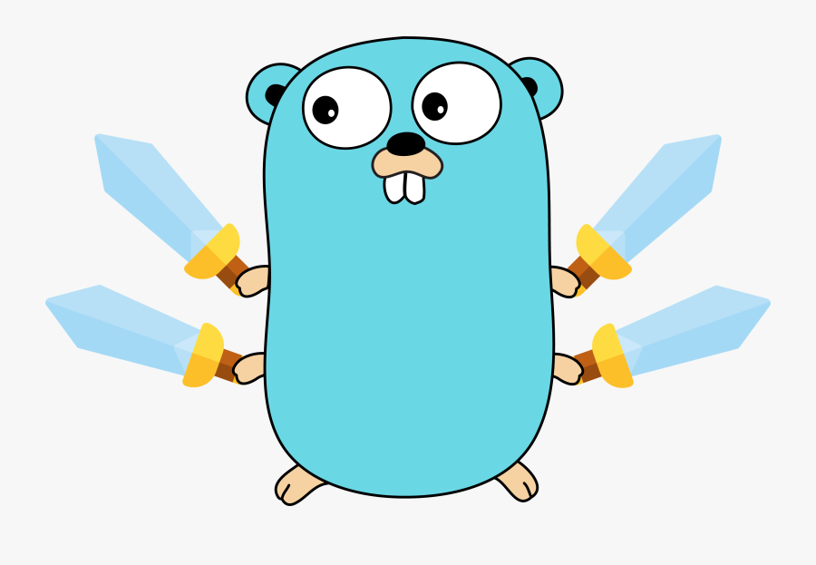

<div align="center">

  
  <h3 align="center">coronavirusapi-go</h3>
  <p align="center">A Golang wrapper to work with the <a href="https://www.covid19api.dev">Coronavirus API</a>.</p>

[](https://github.com/Cloudeya/coronavirusapi-go/releases/latest)
[](/LICENSE)

</div>

---

## How To Use

### Create a new wrapper using the API token

To create a new wrapper call the following function

```go
func NewWrapper(token string) *Wrapper
```

It'll return the new wrapper, and you should be ready to request the API.

### Generate a `token` using `username` and `password`

Use your `username` and `password` to generate a `token` by calling this function

```go
func NewWrapperWithCredentials(username string, password string)  (*Wrapper, error)
```

It'll generate a `token` using the credentials and store the token for further request(s).

**Note:** The `username` and `password` is not stored.

### Request a new token using `username` and `password`

If you are only intersted in generating a new `token`, you can call this function

```go
func (wrapper *Wrapper) GetTokenUsingCredentials(username string, password string) (string, error)
```

It'll return the `token` if the call succeeds, or an error if it fails.

## Available API call in the wrapper

Here is a list of available methods in the `Wrapper`

### Get Global Daily Reports

`GetReportsAt` gets the Global Daily Reports of a specified date.

```go
func (wrapper *Wrapper) GetReportsAt(date time.Time) (*GlobalDailyReport, error) 
```

### Example

```go
package main

import (
	wrapper "Cloudeya/coronavirusapi-go"
	"fmt"
	"time"
)

func main() {
	apiWrapper := wrapper.NewWrapper("Your_Token")
	// Get report for sep2020
	date, _ := time.Parse("2006-Jan", "2020-Sep")
	reports, err := apiWrapper.GetReportsAt(date)
	if err != nil {
		fmt.Printf("%s", err)
	}
	fmt.Printf("Got %d reports for date %s\n", len(reports.Reports), date)
    fmt.Printf("Code: %d\nMessage: %s\nfirst report: %+v\n\nsecond report: %+v\n", reports.Code, reports.Message, reports.Reports[0], reports.Reports[1])
}
```

## Time Series Summary

The following methods get the time series for either `deaths`, `recovered` or `confirmed` cases in the United States or Globally.

### Get Time Series For a case type and country

You can make a custom request using the following method:

`timeSeriesType` can either be `deaths`, `recovered` or `confirmed` and the country either be `us` or `global`.

```go
func (wrapper *Wrapper) GetTimeSeriesFor(timeSeriesType TimeSeriesType, country TimeSeriesCountry) (*TimeSeriesSummary, error) 
```

### Confirmed Global Time Series

```go
func (wrapper *Wrapper) GetTimeSeriesConfirmedGlobal() (*TimeSeriesSummary, error)
```

### Example

```go
package main

import wrapper "Cloudeya/coronavirusapi-go"

func main() {
	apiWrapper := wrapper.NewWrapper("token here")
    deathsGlobal, err := apiWrapper.GetTimeSeriesConfirmedGlobal()
}
```
### Confirmed US Time Series 

```go
func (wrapper *Wrapper) GetTimeSeriesConfirmedUS() (*TimeSeriesSummary, error)
```

## Example

```go
package main

import wrapper "Cloudeya/coronavirusapi-go"

func main() {
	apiWrapper := wrapper.NewWrapper("token here")
    deathsGlobal, err := apiWrapper.GetTimeSeriesConfirmedUS()
}
```

### Global Deaths Time Series 

```go
func (wrapper *Wrapper) GetTimeSeriesDeathsGlobal() (*TimeSeriesSummary, error)
```

### US Deaths Time Series 

```go
func (wrapper *Wrapper) GetTimeSeriesDeathsUS() (*TimeSeriesSummary, error)
```

### Global Recovered Time Series 

```go
func (wrapper *Wrapper) GetTimeSeriesRecoveredGlobal() (*TimeSeriesSummary, error)
```

## Available Structures

### Global Daily Reports

```go
// GlobalDailyReport the Global Daily Reports
type GlobalDailyReport struct {
	Code    int      `json:"Code"`
	Message string   `json:"Message"`
	Reports []Report `json:"Document"`
}

// Report holds the cases data for each month (the reports inside document)
type Report struct {
	ID                int     `json:"id,omitempty"`
	ProvinceState     string  `json:"province_state,omitempty"`
	CountryRegion     string  `json:"country_region,omitempty"`
	LastUpdate        string  `json:"last_update,omitempty"`
	Confirmed         int     `json:"confirmed,omitempty"`
	Deaths            int     `json:"deaths,omitempty"`
	Recovered         int     `json:"recovered,omitempty"`
	Active            int     `json:"active,omitempty"`
	FIPS              string  `json:"fips,omitempty"`
	Admin2            string  `json:"admin2,omitempty"`
	CaseFatalityRatio float64 `json:"case_fatality_ratio,omitempty"`
	CombinedKey       string  `json:"combined_key,omitempty"`
	IncidenceRate     float64 `json:"incidence_rate,omitempty"`
}
```

### Time Series Summary

```go
// TimeSeriesSummary Time Series Summary
type TimeSeriesSummary struct {
	Code    int
	Message string
	Reports []TimeSeriesReport
}

// TimeSeriesReport holds the time series data
type TimeSeriesReport struct {
	ID            int
	UID           int
	ISO2          string
	ISO3          string
	Code3         int
	FIPS          int
	Admin2        string
	CombinedKey   string
	ProvinceState string
	CountryRegion string
	Latitude      float64
	Longitude     float64
	Population    int
	Data          map[string]int
}
 ```

`Data` contains as keys the date and the values is the number of cases.
Example:

```
{
    "may312020":221,
    "jun012020":233,
    "jun022020":239,
    "jun032020":239,
    "jun042020":241,
    "jun052020":248,
}
 ```

## Changing Wrapper Defaults

### API URL

By default, the wrapper uses this URL `https://covid19.cloudeya.org`. To change it, you need to call this function

```go
func (wrapper *Wrapper) SetTimeout(apiTimout time.Duration)
 ```

### HTTP Timeout when calling the API

By default, the timeout is set to `10 seconds`. You can change it by calling this function

```go
func (wrapper *Wrapper) SetTimeout(apiTimout time.Duration)
```

### Wrapper sleep time between retry

By default, the wrapper sleeps for `60 seconds` if the first call to the API is `TooManyRequests`. To change the duration, call this function

```go
func (wrapper *Wrapper) SetTimeSleepBetweenRetry(sleepDuration time.Duration) 
```

## Contributing

Please read [CONTRIBUTING.md](https://gist.github.com/PurpleBooth/b24679402957c63ec426) for details on our code of conduct, and the process for submitting pull requests to us.

## Versioning

We use [SemVer](http://semver.org/) for versioning. For the versions available, see the [tags on this repository](https://github.com/Cloudeya/coronavirusapi-go/tags).

## Authors

- **Finbarrs Oketunji** _aka 0xnu_ - _Product Owner_ - [0xnu](https://github.com/0xnu)
- **Amazzal El-habib** _aka 0xnu_ - _Main Developer_ - [amazzalel-habib](https://github.com/amazzalel-habib)

See also the list of [contributors](https://github.com/Cloudeya/coronavirusapi-go/contributors) who participated in this project.

## License

This project is licensed under the [WTFPL License](LICENSE) - see the file for details.

## Copyright

(c) 2020 [Cloudeya Limited](https://cloudeya.org).
